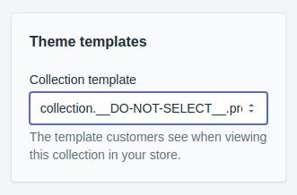

# Crisp

## Features

Crisp is a javascript library that enables advanced search and filtering capabilities for Shopify themes. It moves the filtering client-side which enables some cool stuff like

- Filtering collections by tags, metafields, or anything else!
- Filtering search results by tags, metafields, etc
- Creating a searchable collection

## Demo

- View Crisp in action:
    - [Colourpop](https://colourpop.com/collections/best-sellers)
    - [Flow Parts](https://flowparts.com/collections/all)
- View on the [Demo Store](https://todo.com)

## When **NOT** to use Crisp

Crisp adds a lot of complexity to a Shopify collection page. In many cases it won't be necessary and could cause headaches. That said, if you are just excited to try Crisp skip down to [getting started](#getting-started)

### You have a small catalog of products

It is already easy for your customers to find what they are looking for, there is no need so intimidate them with a bunch of advanced filtering options. Just Shopify's build in Search and Tag filtering should be more than enough.

### You just want infinite scroll or search previews

You don't need Crisp to accomplish this. It is overkill. If this is your goal then consider writing your own [templates](#templates) and making the ajax requests yourself. It also makes it easier to account for some of the [seo concerns](#seo-concerns)

### You want to filter a giant catalog of products

Crisp does it's best to optimize for performance but it can only take it so far. If you are wanting to filter thousands of products without narrowing down the selection first (think `/collections/all`) Crisp may take too long to return results. In this case consider restructuring your "funnel" if you want to use Crisp, or use an app instead.

## How it Works

Crisp is made up of two components, the client and the template. The client is is a Javascript library that allows (relatively) easy access to the filtered data. The second component is the template installed in the Shopify theme which gives the client access to raw unfiltered data.

### Template

Crisp relies on the fairly well-known technique of using Liquid templates to create pages that can be used as JSON endpoints. This allows the client to load and filter data.

The template is simply a secondary template file in your theme (`collection.crisp.liquid` for example) that will never be seen when viewing the website normally. It starts with the line `` which tells Shopify not to include the normal framing content of your site (header, tracking scripts, etc.). It then uses Liquid to build a JSON blob that the client will be able to recognize.

The client will be able to make `fetch` or `ajax` calls to access this JSON data. This can be done by changing the `view` query parameter to match the name of the template (`example.com?view=crisp` for example).

See the [/templates](/templates) folder for some pre-populated examples of templates.

### Client

The client is where the "magic" happens. This is where all of the data loading, filtering, and configuration lives.

At it's most basic, you ask the client to get you some, for example, products from the `shoes` collection. The client will load data from the template url (`/collections/shoes?view=crisp`), process it, and return to you to display to the user.

This gets more complicated when you ask tougher questions. If this time you want Size `9` or `10` running shoes in pink or purple things get a little more complicated under the hood but the interface you communicate with remains the same.

To get a little bit more into it, Crisp tries to find a balance between performance and resource usage while loading and filtering. This involves making some educated guesses in terms of how many shoes to load immediately and cancelling any extraneous requests made from the guesses as quickly as possible. Of course there are still cases where there is only one item that matches the filter constraints and it is the very last one, but in most cases Crisp works quite quickly.

## Seo Concerns

TODO

## Getting Started

### Adding Templates

First up, we need to decide which template(s) you will need to install. This will depend on which features of Crisp you are planning to use. For example, `SearchableCollection` will require a `Collection` template and a `Search` template. If you are unsure which templates are required for a given feature see the corresponding entry in the [API Documentation](#api-documentation) and it will list the required templates.

Now, knowing which templates we will be installing, head over to the [/templates](/templates) directory locate the example files that will need to be installed. Simply copy these files to your theme's `/templates` directory and we are ready to move on

> You may have noticed a strange suffix on all the templates (ex. `__DO-NOT-SELECT__.products`). While this is by no means required, keep in mind that just like any alternate template this will show up in the Shopify Admin as an option for how to display a resource on the storefront. We never want to display this template by default so the underscore prefix ensures it gets pushed to the bottom of the list and, well, the "`DO-NOT-SELECT`" speaks for itself.

> 

### Installing the Client

There are a number of ways to install the client depending on your bundler or toolchain. For this guide however, we will be simply adding it as a script tag.

Head over to the [latest release](/releases/latest) and download `crisp.umd.js`. Next, upload this to your themes `/assets` folder. Now we are ready to import it from the theme.

> As with any dependency, it is good practice to only import resources on pages where they are required. For this example however, we will just be adding a global import in `theme.liquid`.

To import Crisp, add `<script type="text/javascript" src="{{ 'crisp.umd.js' | asset_url }}">` in the `<head>` of your `theme.liquid`.

### Trying it out

Now, to test it out and make sure everything is working correctly we can use the developer console. Navigate to your storefront, open the developer tools (`F12` generally), then head to the `console` tab.

We can now make sure the client has been installed correctly by running

```javascript
Crisp.Version
```

It should print a version number corresponding to the [latest release](/releases/latest) (or whichever version you are using)

Next, we can test out loading and filtering some resources. The exact code you will need to run will depend on which templates you installed by here is an example of loading products from a collection template in the console

```javascript
{
  // Initialize the collection
  const collection = Crisp.Collection({
    handle: 'all',
    template: '__DO-NOT-SELECT__.products',
  });

  // Load first 10 products
  const products = await collection.get({
    number: 10,
  });

  // Print them to the console
  console.log(products);
}
```

## API Documentation
